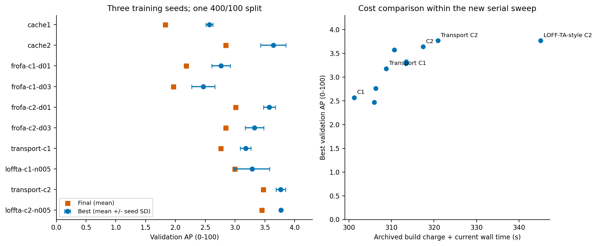
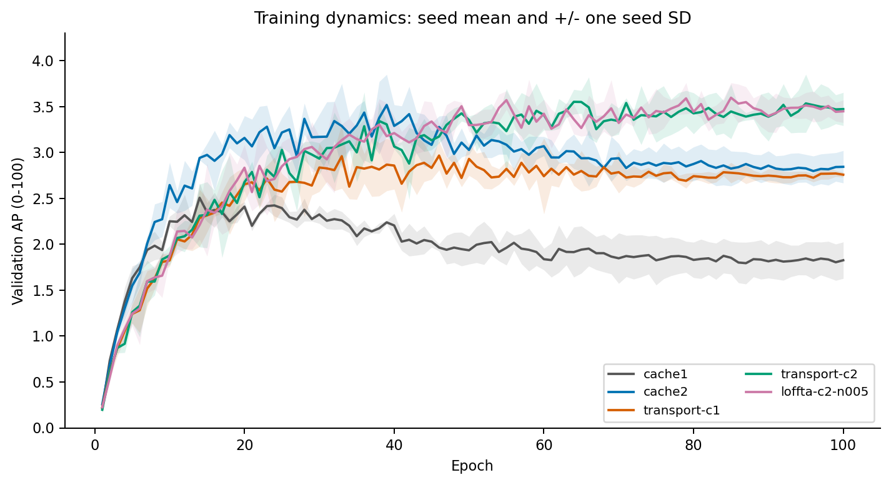

# Feature augmentation pilot: analysis

Question: with the same frozen DINOv3, mean-value head, split and training recipe,
do direct cached-feature augmentations improve detection enough to form stronger baselines?
Evidence: 30 completed runs, 100 epochs each, three seeds per method.
Source hashes, actual run settings, complete curves and summary consistency were checked.
AP has not been independently recomputed from model predictions.

## Numeric results

| Method | Best AP mean +/- SD | Last AP | Train s | Charged build + wall s |
| --- | ---: | ---: | ---: | ---: |
| cache1 | 2.5694 +/- 0.0597 | 1.8258 | 213.6 | 301.2 |
| cache2 | 3.6405 +/- 0.2135 | 2.8434 | 217.7 | 317.4 |
| frofa-c1-d01 | 2.7640 +/- 0.1555 | 2.1806 | 218.0 | 306.3 |
| frofa-c1-d03 | 2.4675 +/- 0.1952 | 1.9620 | 218.3 | 306.0 |
| frofa-c2-d01 | 3.5752 +/- 0.1010 | 3.0076 | 211.0 | 310.7 |
| frofa-c2-d03 | 3.3241 +/- 0.1564 | 2.8405 | 213.5 | 313.5 |
| transport-c1 | 3.1775 +/- 0.0903 | 2.7574 | 220.1 | 308.8 |
| loffta-c1-n005 | 3.2853 +/- 0.2950 | 2.9942 | 223.3 | 313.5 |
| transport-c2 | 3.7666 +/- 0.0810 | 3.4723 | 221.5 | 320.9 |
| loffta-c2-n005 | 3.7675 +/- 0.0161 | 3.4479 | 232.2 | 345.1 |

## Findings and decision

- C1 transport improves mean best AP from 2.5694 to 3.1775 (+0.6081).
  The difference is positive in each of the three seeds.
- The real two-view cache remains a strong control (3.6405 best AP).
- Transport C2 gives 3.7666 best AP and 3.4723 final AP. Its best-AP gain
  over C2 is not positive for every seed; the final-AP gain is positive for all three.
- LOFF-TA-style C2 gives 3.7675 best AP: only about +0.0009 over Transport C2,
  with lower mean final AP (3.4479 versus 3.4723). Mean training time is
  232.2 versus 221.5 seconds. Prioritize Transport C2 as the simpler baseline.
- FroFA delta 0.1 helps C1 on mean best AP; delta 0.3 does not.
  Neither brightness strength improves C2 mean best AP in this sweep.
  These findings are limited to these detection adaptations and two strengths.

## Claim candidates

1. Keep: direct geometric feature augmentation can be useful when training this detector.
   Evidence: transport-c1 versus cache1, paired seeds in stats-appendix.md.
   Do not claim it exactly reconstructs image-augmented DINO features or is universally effective.
2. Revise: an earlier 'Transport is near random' observation cannot describe this protocol.
   Check whether that experiment replaced features under a fixed head, used another head,
   or used different preprocessing/geometry. The current runs retrain the detector.
3. Weaken: the tiny mean advantage of adding noise to C2 is not evidence of superiority.
   See paired seed differences; n=3 does not support a robust winner claim.
4. Defer: there is no online-corrector result in this campaign. No claim of superior
   correction, cross-domain generalization, official AP-small or CVPR readiness follows.

## Next experiment

Compare C2-Mix, C2-Transport and C2-Correct at 10% and 25% matched backbone-query
budgets and seeds 0/1/2. Share query samples, transforms, cached anchors and head
initialization. Count corrector time and all feature-extraction calls.
Use the no-query Transport C2 result as the strong cheap reference.
Then advance a short list to official splits/evaluation, small-object AP and equal GPU time.

## Interpretation limits

This remains 400/100 VisDrone images with a custom COCO-style evaluator.
Best AP is selected on the same small validation set; report final AP too.
FroFA/LOFF-TA are idea adaptations, not full reproductions of the classification papers.
Geometric feature padding uses zeros; augmentation strength and boundary handling matter.
Training caches are GPU resident; full-dataset I/O and memory will differ.
The build charge is the archived initial training-cache cost, added once per run.
Actual additional cache build cost for this sweep is zero. Validation-cache build is excluded.
No raw-image inference acceleration or foundation-backbone removal is established.

## Figures

The first panel compares best/final AP and seed variability; the second includes
the charged initial cache build. The tiny C2 noise gain has no clear advantage in cost.
Error bars are seed SD, not confidence intervals.

Inspect final-epoch retention as well as selected best AP. Cached spatial augmentation
retains more of its best performance than the simple two-view control in this pilot.
Bands indicate +/- one seed SD on the same fixed split.
